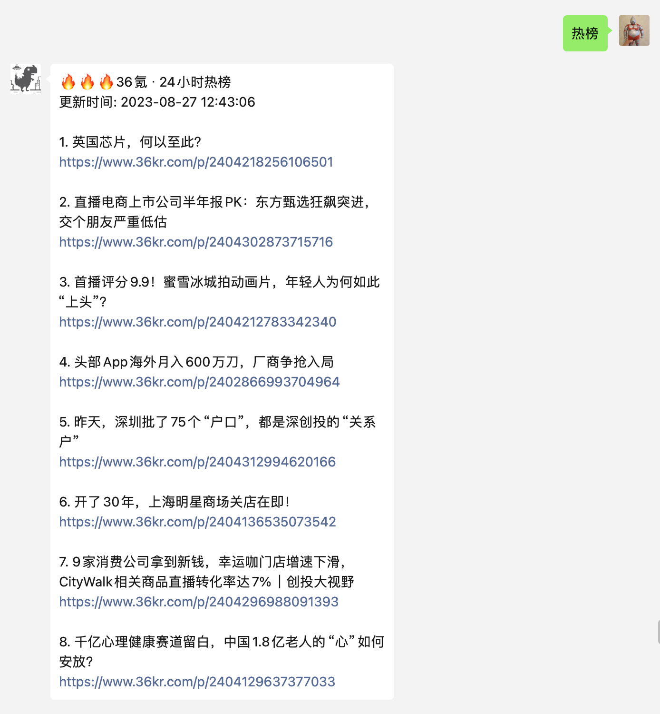

本项目为ChatGPT-ON-Wechat插件，支持今日热榜新闻抓取推送，效果如下：

1. API来源于https://alapi.cn/api/view/50。需自行注册申请token，免费
2. 为方便配置，直接取的是根目录下的变量，需在config.py和config.json中新增两个变量，用来输入不同类型新闻与token 
    "tophub_token":"",
    "tophub_type":"",
3. 通过切换type，可支持不同类型的新闻内容，理论上具体如下
type参数值	说明
zhihu	知乎热榜
weibo	微博热搜
weixin	微信 ‧ 24h热文榜
baidu	百度 ‧ 实时热点
toutiao	今日头条
163	网易新闻
xl	新浪网 ‧ 热词排行榜
36k	36氪 ‧ 24小时热榜(默认)
hitory	历史上的今天
sspai	少数派
csdn	**csdn **今日推荐
juejin	掘金热榜
bilibili	哔哩哔哩热榜
douyin	抖音视频榜
52pojie	吾爱破解热榜
v2ex	V2ex 热帖
hostloc	全球主机论坛热帖

4. 本插件参考JC0v0的早报、星座插件修改，本人0代码基础，感谢伟大的AI，让编程变得如此简单
