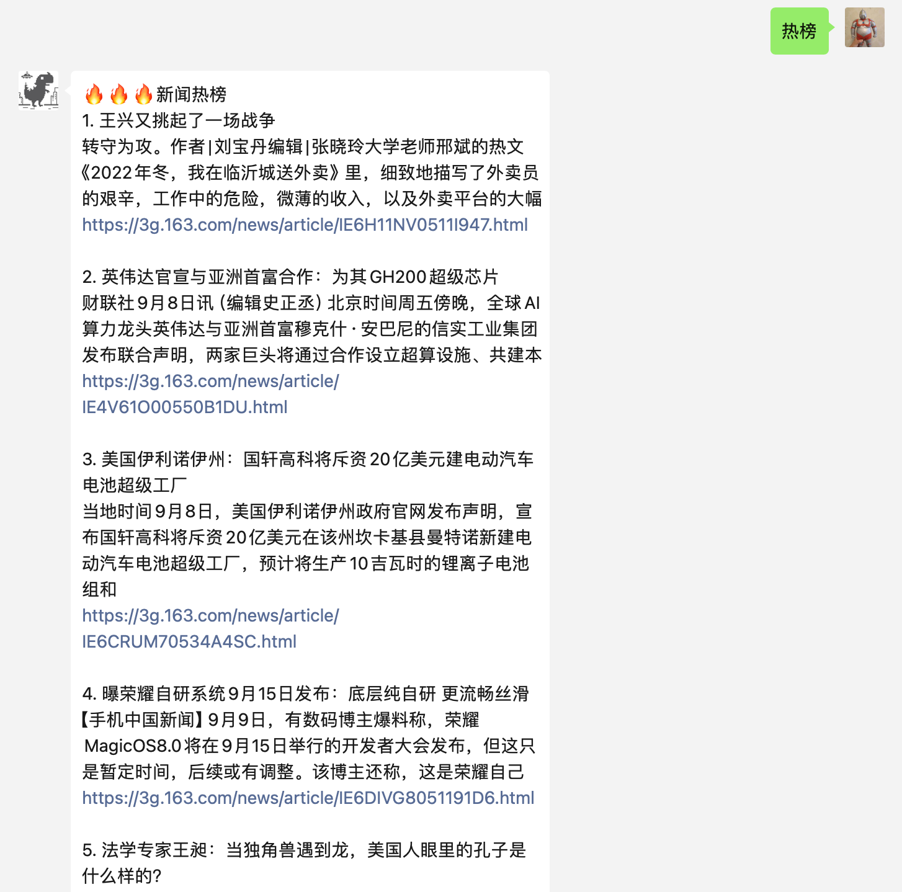

本项目为ChatGPT-ON-Wechat插件，支持今日热榜新闻抓取推送，效果如下：

1. 需自行注册申请token，免费，API来源于https://alapi.cn/api/view/32
2. 为方便配置，直接取的是根目录下的变量，需在config.py和config.json中新增两个变量，用来输入不同类型新闻与token 
    "tophub_token":"",
    "tophub_type":"",
3. 通过切换type，可支持不同类型的新闻内容
    1: 头条
    2: 娱乐
    3: 体育
    4: 财经
    5: 科技
    6: 轻松一刻
    7: 游戏
    8: 读书
    9: 原创
    10: NBA
    11: 历史
    12: 军事
    13: 影视
    14: 中国足球
    15: 国际足球
    16: CAB
    17: 跑步
    18: 手机
    19: 数码
    20: 汽车
    21: 居家
    22: 旅游
    23: 健康
    24: 酒香
    25: 教育
    26: 亲子
    27: 时尚
    28: 情感
    29: 财务
4. 本插件参考JC0v0的早报、星座插件修改，本人0代码基础，感谢伟大的AI，让编程变得如此简单
